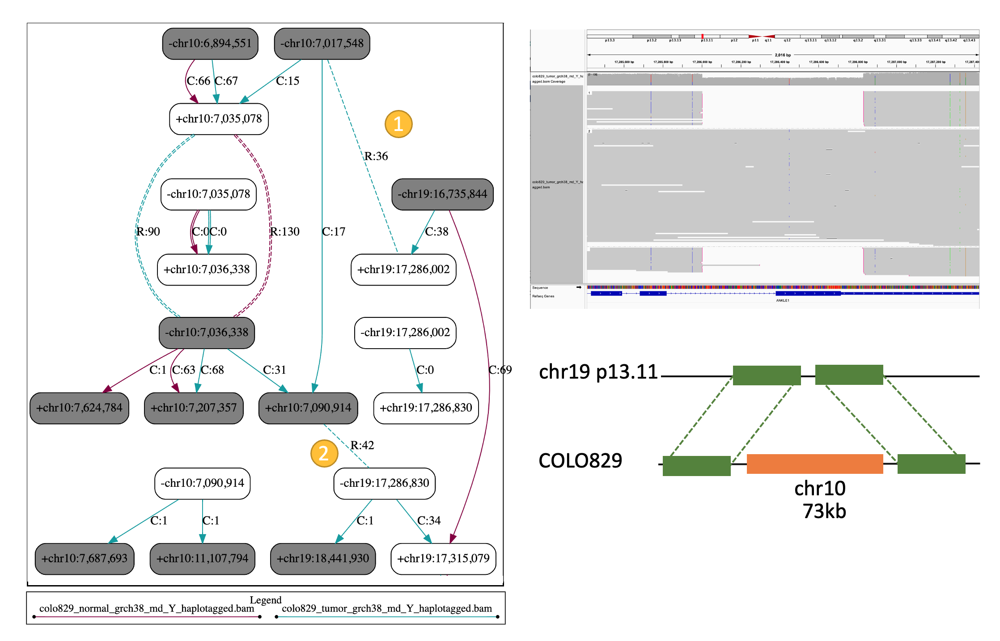

# Severus

A tool to build breakpoint graphs for one or multiple long-read cancer samples. This is work in progress and subject to frequent updates. 

<p align="center">
  
</p>


## Installation

Requirements:
* Python3
* networkx
* numpy
* pydot
* graphviz
* pysam

The easiest way to install dependencies is through conda.

## Quick Start

### Somatic SV calling

```
# Single sample somatic SV calling

./severus.py --target-bam phased_tumor.bam --control-bam phased_normal.bam --out-dir severus_out -t 16 --phasing-vcf phased.vcf --vntr-bed ./vntrs/human_GRCh38_no_alt_analysis_set.trf.bed
dot -Tsvg -O severus_out/breakpoint_graph.dot

# Multisample somatic SV calling

./severus.py --target-bam phased_tumor1.bam phased_tumor2.bam --control-bam phased_normal.bam --out-dir severus_out -t 16 --phasing-vcf phased.vcf --vntr-bed ./vntrs/human_GRCh38_no_alt_analysis_set.trf.bed
dot -Tsvg -O severus_out/breakpoint_graph.gv

```
In the somatic mode default outputs are somatic vcf and somatic breakpoint graph. To generate germline sv calls as well add `--germline`. Providing phased bam files and phasing 
vcf is optional but recommended. For somatic SV calling single control file is supported. 

### Germline SV calling

```
# Single sample SV calling

./severus.py --target-bam phased_tumor.bam --out-dir severus_out -t 16 --phasing-vcf phased.vcf --vntr-bed ./vntrs/human_GRCh38_no_alt_analysis_set.trf.bed
dot -Tsvg -O severus_out/breakpoint_graph.gv

# Multisample SV calling

./severus.py --target-bam phased_tumor1.bam phased_tumor2.bam --out-dir severus_out -t 16 --phasing-vcf phased.vcf --vntr-bed ./vntrs/human_GRCh38_no_alt_analysis_set.trf.bed
dot -Tsvg -O severus_out/breakpoint_graph.gv
```

Providing phased bam files and phasing vcf is optional but recommended.

## Important parameters

### Required

* `--target-bam` path to one or multiple target bam files (must be indexed) 

* `--out-dir` path to output directory

### Optional 

* `--control-bam` path to one or multiple control bam files (must be indexed)

* `--vntr-bed` path to bed file for tandem repeat regions (must be ordered)

* `--phasing-vcf` path to vcf file used for phasing (must for the haplotype specific SV calling)
  
* `--min-support` minimum number of reads supporting a breakpoint [3]
  
## Outputs

### breakpoint_graph.gv  

The primary output is the breakpoint graph, like on the example above. Solid edges correspond to the fragments of the reference genome, (L: length C: coverage)
and dashed colored edges correspond to non-reference connections from reads (R: number of support reads). Each breakpoint is defined by its coordinate
and sign. Plus sign corresponds to connection to the left of breakpoint (reference coordinates), and minus - to the right. 

If control is provided the default output contains only somatic SV calls. To add germline connections as well add `--germline`.

```
# To convert gv format to svg
dot -Tsvg -O severus_out/breakpoint_graph.gv
```

### VCF file

If control is provided the default output contains only somatic SV calls. To generate germline sv calls as well add `--germline`.
If phased bam and phasing vcf is provided haplotype specific SV calls are reported as `0|1` or `1|0`.

### breakpoints_double.csv

Detailed information for all breakpoints detected in any of the bam files provided.

## Other parameters

* `--min-mapq` minimum mapping quality for aligned segment [10]

* `--reference-adjacencies` draw reference adjacencies (as dashed black edges)

* `--max-genomic-len` maximum length of genomic segment to form connected components [100000]

* `--min_sv_size` minimum SV size to be reported [50]

* `--write-germline` to generate germline vcfs and to add germline connection to breakpoint graph


---
### Contact
For advising, bug reporting and requiring help, please contact aysegokce.keskus@nih.gov


