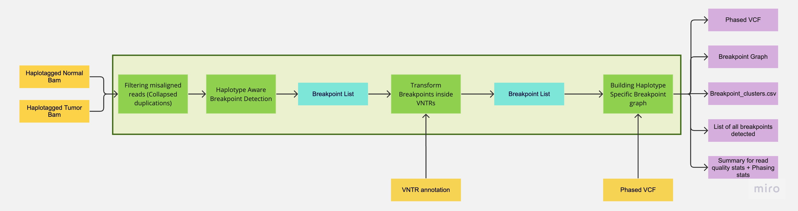

# Severus

<p>

Severus is a somatic structural variation (SV) caller for long reads (both PacBio and ONT). It is designed for matching tumor/normal analysis,
supports multiple tumor samples, and produces accurate and complete somatic and germline calls. Severus takes
advantage of long-read phasing and uses the breakpoint graph framework to model complex chromosomal rearrangements.
</p>

<br/>

## Contents

* [Installation](#installation)
* [Quick Usage](#quick-usage)
* [Input and Parameters](#inputs-and-parameters)
* [Benchmarking Severus and other SV callers](#benchmarking-severus-and-other-sv-callers)
* [Output Files](#output-files)
* [Overview of the Severus algorithm](#overview-of-the-severus-algorithm)
* [Preparing phased and haplotagged alignments](#preparing-phased-and-haplotagged-alignments)
* [Generating VNTR annotation](#generating-vntr-annotation)
* [Additional Fields in the vcf](#additional-fields-in-the-vcf)
* [Breakpoint Graphs](#breakpoint-graphs)

## Installation

The easiest way to install dependencies is through conda:

```
git clone https://github.com/KolmogorovLab/Severus
cd Severus
conda env create --name severus --file environment.yml
```

Once installed, you will need to activate the conda environment prior running:

```
conda activate severus
./severus.py
```

## Quick Usage

Single sample germline SV calling

```
./severus.py --target-bam phased_tumor.bam --out-dir severus_out -t 16 --phasing-vcf phased.vcf \
    --vntr-bed ./vntrs/human_GRCh38_no_alt_analysis_set.trf.bed
```

Single sample somatic SV calling

```
./severus.py --target-bam phased_tumor.bam --control-bam phased_normal.bam --out-dir severus_out \
    -t 16 --phasing-vcf phased.vcf --vntr-bed ./vntrs/human_GRCh38_no_alt_analysis_set.trf.bed
```

Multi-sample somatic SV calling

```
./severus.py --target-bam phased_tumor1.bam phased_tumor2.bam --control-bam phased_normal.bam \
    --out-dir severus_out -t 16 --phasing-vcf phased.vcf \
    --vntr-bed ./vntrs/human_GRCh38_no_alt_analysis_set.trf.bed
```

Haplotagged (phased) alignment input is highly recommended but not required. See [below](#preparing-phased-and-haplotagged-alignments)
for the detailed instructions on how to prepare haplotagged alignments. 
If using haplotagged bam, the matching phased VCF file should be provided as `--phasing-vcf` option.

`--vntr-bed` argument is optional but highly recommended. VNTR annotations for common references are available
in the `vntrs` folder. See [below](#generating-vntr-annotation) how to generate annotations for a custom reference. 

Without `--control-bam`, only germnline variants will be called.

After running, vcf files with somatic and germline calls are available at in the output folder,
along with breakpoint graphs and additional information about SVs. To visualize the breakpoint graph, use:

```
dot breakpoint_graph.gv | gvpack -array_li1 -m 25 | neato -n2 -s -Tsvg > breakpoint_graph.svg
```

## Inputs and Parameters

### Required

```
--target-bam    path to one or multiple target bam files (e.g. tumor, must be indexed) 
--out-dir       path to output directory
```

### Highly recommended

```
--control-bam     path to the control bam file (e.g. normal, must be indexed)
--vntr-bed        path to bed file for tandem repeat regions (must be ordered)
--phasing-vcf     path to vcf file used for phasing (if using haplotype specific SV calling)
```

### Optional parameters

```
--threads               number of threads [8]
--min-support           minimum number of reads supporting a breakpoint [3]
--TIN-ratio             tumor in normal ratio [0.01]
--min-mapq              minimum mapping quality for aligned segment [10]
--max-genomic-len       maximum length of genomic segment to form connected components [50000]
--min-sv-size           minimum SV size to be reported [50]
--min-reference-flank   minimum distance between a breakpoint and reference ends [10000]
--write-alignments      write read alignments to file
--bp-cluster-size       maximum distance in bp cluster [50]
--output-all            outputs FAIL SVs in addition to PASS SVs
--write-collapsed-dup   outputs a bed file with identified collapsed duplication regions
--no-ins-seq            do not output insertion sequences to the vcf file
--inbetween-ins         report unmapped insertions around breakpoints
--only-somatic          omits germline outputs in the somatic mode
--output_LOH            outputs a bed file with predicted LOH regions
--tra-to-ins            converts insertions to translocations if mapping is known
--output-read-ids       outputs read IDs for support reads
```

## Benchmarking Severus and other SV callers

### Germline benchmarking results using HG002

First, we verified performance of Severus on a germline SV benchmark. 
We compared Severus, [sniffles2](https://github.com/fritzsedlazeck/Sniffles) and [cuteSV](https://github.com/tjiangHIT/cuteSV) using 
[HG002 GIAB SV benchmark set](https://www.nature.com/articles/s41587-020-0538-8). Comparison was perfromed using `truvari`.
The benchamrking was done against the grch38 reference, for consistency with the benchmarks below (confident regions were lifted over).
Severus and Sniffles2 performed similarly, with CuteSV running a bit behind.

|SV Caller | TP | FN | FP  | Precision | Recall | F1 score |
|----------|----|----|-----|-----------|--------|----------|
| Severus  |9453| 402| 345 | 0.965     | 0.959  | 0.962    |
| sniffles2|9459| 396| 336 | 0.960     | 0.966  | 0.963    |
| cuteSV   |9231| 624| 676 | 0.936     | 0.931  | 0.934    |

### Somatic benchmarking results COLO829

We compared the performance of existing somatic SV callers [nanomonSV](https://github.com/friend1ws/nanomonsv), [SAVANA](https://github.com/cortes-ciriano-lab/savana) 
and [sniffles2](https://github.com/fritzsedlazeck/Sniffles) in mosaic mode using COLO829 cell line data against multi-platform 
[Valle-Inclan et al. truthset](https://www.sciencedirect.com/science/article/pii/S2666979X22000726).  
Because `truvari` was primarily designed for indel comparison, we compared somatic SVs by 
matching individual breakpoints (defined by a pair of reference coordinates). Severus had the highest recall and precision on the HiFi dataset,
and highest recall on the ONT dataset, with SAVANA having highest precision.

#### Pacbio HiFi

|SV Caller  | TP | FP | FN | Precision | Recall   | F1 score |
|-----------|----|----|----|-----------|----------|----------|
| Severus   | 59 | 33 | 9  | **0.64**  | **0.87** | **0.74** |
| nanomonsv | 52 | 55 | 16 | 0.49      | 0.76     | 0.59     |
| sniffles2 | 46 | 252| 22 | 0.15      | 0.68     | 0.25     |
| SAVANA    | 55 | 88 | 13 | 0.38      | 0.8      | 0.52     |

#### Oxford Nanopore

|SV Caller | TP  | FP  | FN | Precision | Recall | F1 score |
|----------|-----|-----|----|-----------|--------|----------|
| Severus  | 53  | 33  | 15 |  0.61     |**0.78**| 0.69     |
| nanomonsv| 44  | 46  | 24 |  0.49     | 0.65   | 0.56     |
| sniffles2| 35  | 263 | 33 |  0.12     | 0.51   | 0.19     |
| SAVANA   | 51  | 18  | 17 | **0.74**  | 0.75   | **0.74** |

### Somatic Benchmarking results: Tumor/Normal Cell line pairs

We compared the performance of the somatic SV callers using 4 tumor/normal cell line pairs. Since no ground truth
SV calls are available, we created an ensemble set of SVs supported by 2+ long-read methods for each dataset.
This assumes that singleton calls are false-positives, and calls supported by multiple tools are more reliable.
Severus consistently had the highest recall and precision against the ensemble SV sets.

#### H2009/BL2009

|SV Caller  | TP  | FP  | FN  | Precision | Recall | F1 score |
|-----------|-----|-----|-----|-----------|--------|----------|
| Severus   | 841 | 104 | 34  | **0.89**  |**0.96**| **0.92** |
| nanomonsv | 758 | 226 | 117 | 0.77      | 0.87   | 0.82     |
| sniffles2 | 542 | 717 | 333 | 0.43      | 0.62   | 0.51     |
| SAVANA    | 711 | 329 | 164 | 0.68      | 0.81   | 0.74     |

#### H1437/BL1437

|SV Caller  | TP  | FP | FN  | Precision | Recall | F1 score |
|-----------|-----|----|-----|-----------|--------|----------|
| Severus   | 200 | 72 | 13  |**0.74**   |**0.94**| **0.82** |
| nanomonsv | 172 | 92 | 41  | 0.65      | 0.81   | 0.72     |
| sniffles2 | 111 | 442| 102 | 0.20      | 0.52   | 0.29     |
| SAVANA    | 199 | 79 | 14  | 0.72      | 0.93   | 0.81     |

#### HCC1937/HCC1937BL

|SV Caller  | TP  | FP  | FN  | Precision | Recall | F1 score |
|-----------|-----|-----|-----|-----------|--------|----------|
| Severus   | 597 | 169 | 47  | **0.78**  |**0.93**| **0.85** |
| nanomonsv | 503 | 278 | 141 | 0.64      | 0.78   | 0.71     |
| sniffles2 | 320 | 754 | 324 | 0.30      | 0.50   | 0.37     |
| SAVANA    | 540 | 353 | 104 | 0.60      | 0.84   | 0.70     |

#### HCC1954/HCC1954BL

|SV Caller  | TP  | FP  | FN  | Precision | Recall | F1 score |
|-----------|-----|-----|-----|-----------|--------|----------|
| Severus   | 819 | 100 | 51  | **0.89**  |**0.94**| **0.92** |
| nanomonsv | 703 | 167 | 167 | 0.81      | 0.81   | 0.81     |
| sniffles2 | 245 | 566 | 625 | 0.30      | 0.28   | 0.29     |
| SAVANA    | 802 | 392 | 68  | 0.67      | 0.92   | 0.78     |


## Output Files

### VCF file

For each target sample, Severus outputs a VCF file with somatic SV calls.
If the input alignment is haplotagged, VCF will be phased. In addition,
Severus outputs a set of all SVs (somatic + germline) for each input sample.
VCF contains additional information about SVs, such as the clustering of complex
variants. Please see the detailed description [below](#additional-fields-in-the-vcf).

### breakpoint_graph.gv

Severus also outputs a breakpoint graph in graphvis format that describes the derived structure
of tumor haplotypes. Solid edges correspond to the fragments of the reference genome (L: length C: coverage)
and dashed colored edges correspond to non-reference connections from reads (R: number of support reads). 
See the detailed description of the graph format [below](#breakpoint-graphs). `breakpoints_clusters.csv` contains the
same breakpoint information in the text format.

### breakpoint_double.csv

Detailed info about the deteted breakpoints for all samples in text format, intended for an advanced user.

```
# To convert gv format to svg
dot -Tsvg -O severus_out/breakpoint_graph.gv
```

## Overview of the Severus algorithm

<p align="center">
  
</p>

Somatic SVs in cancer are typically more complex compared to germline SVs. For example, breakage-fusion-bridge (BFB) amplifications 
are characterized by multiple foldback inversions and oscillating copy numbers. Current long-read SV algorithms were designed 
for relatively simple germline variation and do not automatically detect complex multi-break rearrangements in cancer.
Severus is designed to provide a comprehensive view of somatic and germline SVs, and implements several algorithmic novelties.
The algorithm has modes for `single`, `two (e.g., tumor/normal)`, and `multiple samples` (e.g., multi-site or time series). 

**Haplotype-specific SVs**. A key advantage of long-read sequencing is the ability to phase variants into longer haplotypes, without the need of any additional data. 
Both germline and somatic variants can be phased, however somatic variants must still be attributed to a single germline haplotype of origin. 
If the normal sample is available, we perform SNP calling and phasing of the normal sample alignment, 
and then haplotag both normal and tumor alignments. In the absence of a normal sample, phasing of tumor alignment data can be performed instead. 

**Mismapped repeats filtering**. Mismapped reads from wrong repeat copies may artificially inflate (or deplete) 
the coverage of the region, and these reads may contain SV signatures, resulting in false-positive calls. 
It is one of the major sources of false positive somatic SV calls, as mismapped read alignment is often unstable and may vary between tumor and normal samples. 
Since the copies of evolutionary divergent repeats are not identical, a common signature of mismapped repeats is an increased sequence divergence. 
Severus filters out mismaped repetitive reads with an increased subtitution rates.

**VNTR synchronization**. Variation inside variable number tandem repeats (VNTRs) is another major source of error in SV analysis. This is because the alignment inside the VNTR regions is often ambiguous. 
Since reads contain errors at random positions, this may affect the scores of the near-optimal alignments in different ways. For each read, Severus transforms the SV signatures 
inside annotated VNTR regions into a uniform coordinate system. 

**Breakpoint graph**. Each SV signature (extracted from an individual read) connects two non-adjacent breakpoints of the reference genome. 
We will denote these regions as `start_pos` and `end_pos`. Each breakpoint has a direction, either `left` or `right`. Thus, an SV signature is defined by a pair of breakpoints: 
`(start_pos, start_dir):(end_pos, end_dir)`. For example, a deletion at position `P` of size `L` corresponds to: `(P, left):(P + L, right)`. 

Given a set of SV signatures, they are clustered based on their start and end breakpoints. For each accepted cluster that passes several quality thresholds, 
we create two nodes on the breakpoint graph (for start and end breakpoints), and connect the nodes with an `adjacency` edge. We then add `genomic` edges
that corrspond to target genome segments using long reads that span multiple consecutive SVs. Genomic edges are also formed for distant breakpoints that
are not connected by long reads, but are in the same (germline) phase and consistent direction. 

As a result, the connected components of the constructed breakpoint graph naturally represent clusters of SVs, for example chains of deletions or translocations. To capture
more complex and potentially overlapping SVs - such as chromoplexy or breakage-fusion-bridge - we perform additional clustering specific to complex SV types.


## Preparing phased and haplotagged alignments

<p align="left">
  
</p>

We recommend running Severus with phased and haplotagged tumor and normal alignments. Below is an example
workflow that can be used to produce them, assuming that reads are already aligned using minimap2/pbmm2.
If phasing is difficult or not possible (e.g. haploid genome), unphased alignment can be used as input.

If normal sample is available:
* 1. SNP calling and phasing normal bam. See for [DeepVariant](https://github.com/google/deepvariant) and [margin](https://github.com/UCSC-nanopore-cgl/margin). 

  + Using DeepVariant + Margin

```
# To install DeepVariant and margin using singularity

 singularity pull docker://google/deepvariant:latest
 docker pull kishwars/pepper_deepvariant:latest
 
# To generate phased VCF for ONT R10 data using DeepVariant + Margin

singularity run --nv -B /usr/lib/locale/:/usr/lib/locale/ deepvariant_latest.sif run_deepvariant \
--model_type ONT_R104 
--ref ref.fa \
--reads normal.bam \
--output_vcf normal_vcf.vcf \
--num_shards 56

docker run kishwars/pepper_deepvariant:latest \
margin phase normal.bam ref.fa normal_vcf.vcf allParams.haplotag.ont-r104q20.json -t 56 -o output_dir

# To generate phased VCF for PacBio HiFi data using DeepVariant + Margin

singularity run --nv -B /usr/lib/locale/:/usr/lib/locale/ deepvariant_latest.sif run_deepvariant \
--model_type PACBIO \
--ref ref.fa \
--reads normal.bam \
--output_vcf normal_vcf.vcf \
--num_shards 56

docker run kishwars/pepper_deepvariant:latest \
margin phase normal.bam ref.fa normal_vcf.vcf allParams.haplotag.pb-hifi.json -t 56 -o output_dir

```

  + Using Clair3

For the complete list of the available models, [see](https://github.com/HKU-BAL/Clair3/tree/main#pre-trained-models). with `--enable_phasing` and `--longphase_for_phasing` [Clair3](https://github.com/HKU-BAL/Clair3) generates unphased and phased vcfs using [LongPhase](https://academic.oup.com/bioinformatics/article/38/7/1816/6519151). 

```
# To install Clair3

 singularity pull docker://google/deepvariant:latest
 docker pull kishwars/pepper_deepvariant:latest
 
# To generate phased VCF using Clair3

INPUT_DIR="[YOUR_INPUT_FOLDER]"       
OUTPUT_DIR="[YOUR_OUTPUT_FOLDER]"      
THREADS="[MAXIMUM_THREADS]"            
MODEL_NAME="[YOUR_MODEL_NAME]"

docker run -it \
  -v ${INPUT_DIR}:${INPUT_DIR} \
  -v ${OUTPUT_DIR}:${OUTPUT_DIR} \
  hkubal/clair3:latest \
  /opt/bin/run_clair3.sh \
  --bam_fn=${INPUT_DIR}/input.bam \    
  --ref_fn=${INPUT_DIR}/ref.fa \       
  --threads=${THREADS} \               
  --platform="ont" \                   
  --model_path="/opt/models/${MODEL_NAME}" \
  --output=${OUTPUT_DIR} \
  --enable_phasing \
  --longphase_for_phasing

```

* 2. Haplotagging normal and tumor bams using phased vcf from step1. See for [whatshap](https://whatshap.readthedocs.io/en/latest/index.html)

```
# To install WhatsHap using Conda

 conda create -n whatshap-env whatshap 
 conda activate whatshap-env
 
# To haplotag Normal and Tumor

whatshap haplotag --reference ref.fa phased_vcf.vcf normal.bam -o normal.haplotagged.bam --ignore-read-groups --tag-supplementary --skip-missing-contigs --output-threads=4

whatshap haplotag --reference ref.fa phased_vcf.vcf tumor.bam -o tumor.haplotagged.bam --ignore-read-groups --tag-supplementary --skip-missing-contigs --output-threads=4

```

## Generating VNTR annotation

<p align="left">
  
</p>

Alignments to highly repetitive regions are often ambigous and leads false positives. Severus clusters SVs inside a single VNTR region to uniform the SV representation for each read.

In the example above, alignment led two deletion inside a vntr. Severus combines two deletions and transform them into a single longer deletion.

VNTR annotation file for the most commonly used genomes are generated using [findTandemRepeats](https://github.com/PacificBiosciences/pbsv/tree/master/annotations) and provided in the [vntrs](../vntrs) folder .

To generate VNTR annotation file for a new genome using [findTandemRepeats](https://github.com/PacificBiosciences/pbsv/tree/master/annotations):

```
findTandemRepeats --merge <REF>.fa <REF>.trf.bed

```

## Additional fields in the vcf

Severus outputs several unique fileds in INFO column.

* `DETAILED_TYPE` : Severus can identify SV types other than standart SV types; INS, DEL, INV, BND. Additional types: 

  + `foldback`: foldback inversion
  + `BFB-like`: Two matching foldback inversions
  + `Inter_chr_ins`: one chromosome piece inserted into another one
  + `Intra_chr_ins`: one chromosome piece inserted into the same chromosome
  + `Complete_inv`: a full inversion with matching (+,+) and (-,-) adjecencies. 

* `INSLEN`: if `--inbetween-ins` added to run severus, it outputs the length of unmapped sequence between two ends.

* `HVAF` : if phasing vcf is provided, severus calculates haplotype specific variant allele frequency (H0|H1|H2).

* `PHASESET_ID` : if phasing vcf is provided, severus outputs phaseset ID from phasing vcf for phased SVs.

* `CLUSTERID` : subgraph ID from breakpoint graph.  
   

## Breakpoint Graphs

<p align="center">
  
</p>

The primary output of Severus is the breakpoint graph generated separately for somatic and germline SVs and the accompanying breakpoint_clusters.csv file. 
After identifying breakpoint pairs (or a single breakpoint and insertion sequence in unmapped insertions), it adds the adjacency edges (dashed edges) between them. 
The second step is to add genomic segments as it connects breakpoints to the nearest breakpoints based on genomic coordinates and direction: i) 
both breakpoints are in the same phase block and haplotype, and (iii) the length is less than MAX_GENOMIC_DIST (50000 by default). 
Genomic segments are labeled as chromosome:start-end C: Coverage, L: length of the genomic segment. 

Phase block switch points are defined as the midpoint between the last SNP of the phase block and the first SNP of the consecutive phase block. 
Phase block switch points are depicted as gray points and connected to genomic edges through gray dashed edges. 
 
Adjacencies are represented with double edges and single edges supported by both haplotypes and single haplotypes (or unphased reads).
In case of an adjacency supported by phased and unphased reads, the unphased reads are added to the haplotype with the highest number of support reads.
The edges are labeled with the number of support reads (R: XX).

Subgraph IDs shown at the top-left corner of each cluster are also output in vcfs in CLUSTER_ID filed in the INFO column.

The breakpoints in each cluster and the number of support reads are also summarized in breakpoint_cluster.csv. 

In the example above, there is a deletion in one of the haplotypes (chr19: 9040865- 9041235),
and there is an insertion of a 73.3kb region in chr10 to chr19 in the other haplotype.

License
-------

Severus is distributed under a BSD license. See the [LICENSE file](LICENSE) for details.


Credits
-------

Severus is developed in Kolmogorov Lab at the National Cancer Institute.

Key contributors:

* Ayse Keskus
* Asher Bryant
* Mikhail Kolmogorov

---
### Contact
For advising, bug reporting and requiring help, please submit an [issue](https://github.com/KolmogorovLab/Severus/issues).
You can also contact the developer: aysegokce.keskus@nih.gov
