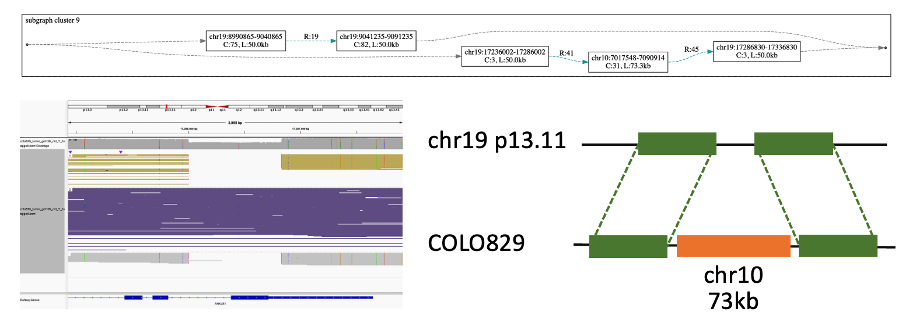
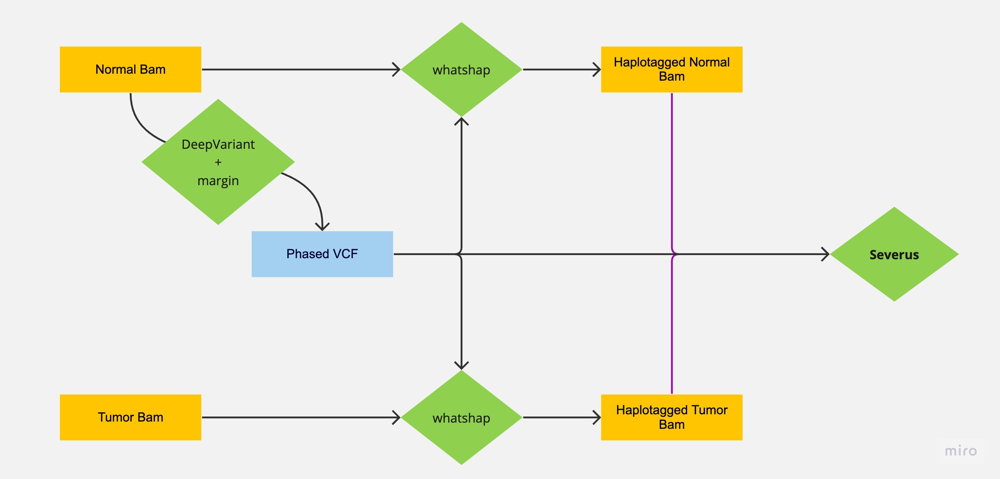
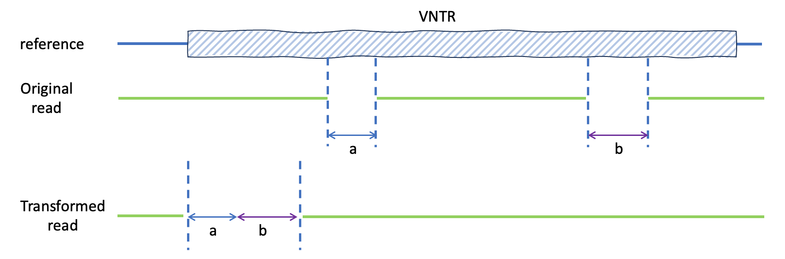
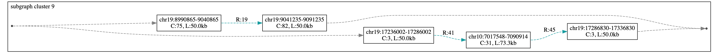

# Severus

Severus is a tool to call somatic and germline structural variations (SV) in single or multi sample long-read sequencing data. Severus tested for both Pacbio and Oxford Nanopore read data ([see results](## Why use Severus?)).  
Severus builds breakpoint graphs for one or multiple long-read cancer samples to cliuster complex SVs.

<p align="center">
  
</p>


## Contents
* [Installation](#installation)
* [Usage](#usage)
  + [Somatic SV calling](#somatic-sv-calling)
  + [Germline SV calling](#germline-sv-calling)
  + [Input and Parameters](#inputs-and-parameters)
  + [Output Files](#output-files)
* [Additional Information](#additional-information)
  + [Phasing Tumor Normal pair](#phasing-tumor-normal-pair)
  + [SVs inside VNTRs](#svs-inside-vntrs)
  + [Additional Fields in the vcf](#additional-fields-in-the-vcf)
  + [Breakpoint Graphs](#breakpoint-graphs)


## Installation

Requirements:
* Python3
* networkx
* numpy
* pydot
* graphviz
* pysam

The easiest way to install dependencies is through conda.

```
conda env create --name <env> --file environment.yml
```

## Usage

### Somatic SV calling

```
# Single sample somatic SV calling

./severus.py --target-bam phased_tumor.bam --control-bam phased_normal.bam --out-dir severus_out -t 16 --phasing-vcf phased.vcf --vntr-bed ./vntrs/human_GRCh38_no_alt_analysis_set.trf.bed
dot -Tsvg -O severus_out/breakpoint_graph.dot

# Multisample somatic SV calling

./severus.py --target-bam phased_tumor1.bam phased_tumor2.bam --control-bam phased_normal.bam --out-dir severus_out -t 16 --phasing-vcf phased.vcf --vntr-bed ./vntrs/human_GRCh38_no_alt_analysis_set.trf.bed
dot -Tsvg -O severus_out/breakpoint_graph.gv

```
Providing phased bam files and phasing vcf is optional but recommended. For somatic SV calling single control file is supported. 

### Germline SV calling

```
# Single sample SV calling

./severus.py --target-bam phased_tumor.bam --out-dir severus_out -t 16 --phasing-vcf phased.vcf --vntr-bed ./vntrs/human_GRCh38_no_alt_analysis_set.trf.bed
dot -Tsvg -O severus_out/breakpoint_graph.gv

# Multisample SV calling

./severus.py --target-bam phased_tumor1.bam phased_tumor2.bam --out-dir severus_out -t 16 --phasing-vcf phased.vcf --vntr-bed ./vntrs/human_GRCh38_no_alt_analysis_set.trf.bed
dot -Tsvg -O severus_out/breakpoint_graph.gv
```

Providing phased bam files and phasing vcf is optional but recommended.

## Inputs and Parameters

### Required

* `--target-bam` path to one or multiple target bam files (must be indexed) 

* `--out-dir` path to output directory

## All parameters

* `--control-bam` path to one or multiple control bam files (must be indexed)

* `--vntr-bed` path to bed file for tandem repeat regions (must be ordered)

* `--phasing-vcf` path to vcf file used for phasing (must for the haplotype specific SV calling)

* `--threads` number of threads [8]
  
* `--min-support` minimum number of reads supporting a breakpoint [3]

* `--TIN-ratio` tumor in normal ratio [0.01]

* `--min-mapq` minimum mapping quality for aligned segment [10]

* `--max-genomic-len` maximum length of genomic segment to form connected components [50000]

* `--min-sv-size` minimum SV size to be reported [50]

* `--min-reference-flank` minimum distance between breakpoint and sequence ends [10000]

* `--write-alignments` write read alignments to file

* `--filter-small-svs` filters SVs smaller than 5000b for improved graphs

* `--bp-cluster-size` maximum distance in bp cluster [50]

* `--output-all` outputs FAIL SVs in addition to PASS SVs

* `--write-collapsed-dup` outputs a bed file with identified collapsed duplication regions

* `--no-ins-seq` omits insertion sequence in vcf file

* `--inbetween-ins` omits insertion sequence in vcf file

* `--only-somatic` omits germline outputs in somatic mode

* `--output_LOH` outputs a bed file with predicted LOH regions

* `--ins-to-tra` converts insertions to translocations if position is known


## Output Files

### breakpoint_graph.gv  

The primary output is the breakpoint graph, like on the example above. Solid edges correspond to the fragments of the reference genome, (L: length C: coverage)
and dashed colored edges correspond to non-reference connections from reads (R: number of support reads). Each breakpoint is defined by its coordinate.

```
# To convert gv format to svg
dot -Tsvg -O severus_out/breakpoint_graph.gv
```

### VCF file

If phased bam and phasing vcf is provided haplotype specific SV calls are reported as `0|1` or `1|0`.

### breakpoints_double.csv

Detailed information for all breakpoints detected in any of the bam files provided.


## Benchmarking Results

### Germline benchmarking results using HG002

We compared performance of Severus, [sniffles2](https://github.com/fritzsedlazeck/Sniffles) and [cuteSV](https://github.com/tjiangHIT/cuteSV) in [HG002 GIAB SV benchmark set](https://www.nature.com/articles/s41587-020-0538-8).  

|SV Caller| TP | FP | FN | Recall | F1 score |
|---------|----|----|----|--------|----------|
| Severus |9453| 345| 402| 0.965| 0.962|
| sniffles2|9459| 336| 396| 0.966| 0.963|
| cuteSV |9231| 676| 624| 0.937| 0.934|

### Somatic benchmarking results COLO829

We compared the performance of existing somatic SV callers [nanomonSV](https://github.com/friend1ws/nanomonsv), [SAVANA](https://github.com/cortes-ciriano-lab/savana) and [sniffles2](https://github.com/fritzsedlazeck/Sniffles) in mosaic mode using COLO829 cell line data against multi-platform [Valle-Inclan et al. truthset](https://www.sciencedirect.com/science/article/pii/S2666979X22000726). 

#### Oxford Nanopore

|SV Caller| TP | FN | FP | Recall | F1 score |
|---------|----|----|----|--------|----------|
| Severus | 53 | 15 | 35 | 0.78   | 0.68 | 
| nanomonsv| 44 | 24 | 46 | 0.65 | 0.56 |
| sniffles2| 35 | 33 | 263 | 0.51 | 0.19 | 
| SAVANA | 51 | 17 | 18 | 0.75 | 0.74 |

#### Pacbio

|SV Caller| TP | FP | FN | Recall | F1 score |
|---------|----|----|----|--------|----------|
| Severus | 59 | 9 | 33 | 0.87 | 0.74 | 
| nanomonsv| 47 | 21 | 27 | 0.69 | 0.66 |
| sniffles2| 40 | 28 | 181 | 0.59 | 0.28 |
| SAVANA | 48 | 20 | 24 | 0.70 | 0.69 |


## Additional Information

### Phasing tumor-normal pair

<p align="center">
  
</p>

If normal sample is available:
* 1. SNP calling and phasing normal bam. See for [DeepVariant](https://github.com/google/deepvariant) and [margin](https://github.com/UCSC-nanopore-cgl/margin). 
* 2. Haplotagging normal and tumor bams using phased vcf from step1. See for [whatshap](https://whatshap.readthedocs.io/en/latest/index.html)

### SVs inside VNTRs

Alignments to highly repetitive regions are often ambigous and often leads false positives. Severus clusters SVs inside a single VNTR region to uniform the SV representation for each read.

<p align="center">
  
</p>

In the example above, alignment led two deletion inside a vntr. Severus combines two deletions and transform them into a single longer deletion.

VNTR annotation file for the most commonly used genomes are generated using [findTandemRepeats](https://github.com/PacificBiosciences/pbsv/tree/master/annotations) and provided in the [vntrs](../vntrs) folder .

To generate VNTR annotation file for a new genome using [findTandemRepeats](https://github.com/PacificBiosciences/pbsv/tree/master/annotations):

```
findTandemRepeats --merge <REF>.fa <REF>.trf.bed

```


### Additional fields in the vcf

Severus outputs several unique fileds in INFO column.

* `DETAILED_TYPE` : Severus can identify SV types other than standart SV types; INS, DEL, INV, BND. Additional types: 

  + `foldback`: foldback inversion
  + `BFB-like`: Two matching foldback inversions
  + `Inter_chr_ins`: one chromosome piece inserted into another one
  + `Intra_chr_ins`: one chromosome piece inserted into the same chromosome
  + `Complete_inv`: a full inversion with matching (+,+) and (-,-) adjecencies. 

* `INSLEN`: if `--inbetween-ins` added to run severus, it outputs the length of unmapped sequence between two ends.

* `HVAF` : if phasing vcf is provided, severus calculates haplotype specific variant allele frequency (H0|H1|H2).

* `PHASESET_ID` : if phasing vcf is provided, severus outputs phaseset ID from phasing vcf for phased SVs.

* `CLUSTERID` : subgraph ID from breakpoint graph.  
   

### Breakpoint Graphs

<p align="center">
  
</p>

The primary output of Severus is the breakpoint graph generated separately for somatic and germline SVs and the accompanying breakpoint_clusters.csv file. 
After identifying breakpoint pairs (or a single breakpoint and insertion sequence in unmapped insertions), it adds the adjacency edges (dashed edges) between them. 
The second step is to add genomic segments as it connects breakpoints to the nearest breakpoints based on genomic coordinate and direction i) that both breakpoints are in the same phase block and haplotype and (iii) the length is less than MAX_GENOMIC_DIST (50000 by default). Genomic segments are labeled as chromosome:start-end C: Coverage, L: length of the genomic segment. 

Phase block switch points are defined as the midpoint between the last SNP of the phase block and the first SNP of the consecutive phase block. Phase block switch points are depicted as gray points and connected to genomic edges through gray dashed edges. 
 
Adjacencies are represented with double edges and single edges supported by both haplotypes and single haplotypes (or unphased reads). In case of an adjacency supported by phased and unphased reads, the unphased reads are added to the haplotype with the highest number of support reads. The edges are labeled with the number of support reads (R:XX).

Subgraph IDs shown at the top-left corner of each cluster are also output in vcfs in CLUSTER_ID filed in the INFO column.

The breakpoints in each cluster and the number of support read are also summarized in breakpoint_cluster.csv. 

In the example above, there is a deletion in one of the haplotypes (chr19: 9040865- 9041235), and there is an insertion of 73.3kb region in chr10 to chr19 in the other haplotype. 

---
### Contact
For advising, bug reporting and requiring help, please contact aysegokce.keskus@nih.gov


